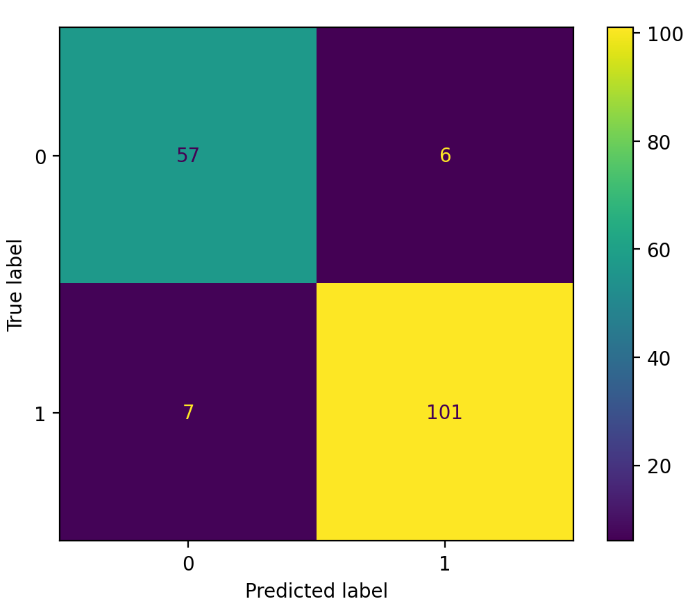
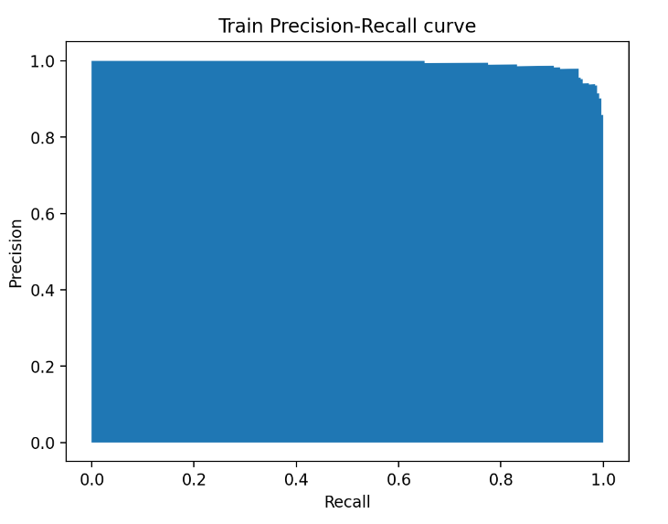
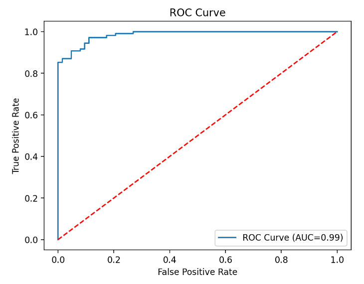
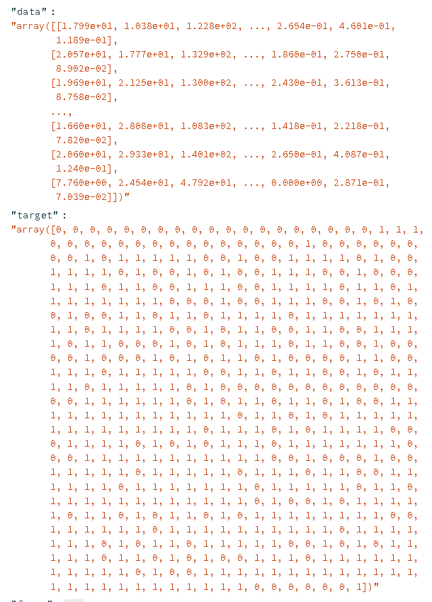

All apps created using Streamlit and Python

🍈 Breast Cancer Binary Classification app.

<H3>Requirements</H3>
* streamlit | * sklearn.metrics | * numpy | * matplotlib.pyplot | * sklearn.datasets | sklearn.naive_bayes | sklearn.model_selection

<H3>Version</H3>
Python 3.12.2 | Streamlit

<H3>Deployments</H3>
https://breast-cancer-binclass.streamlit.app/

<H3>Show Me</H3>

 
 
